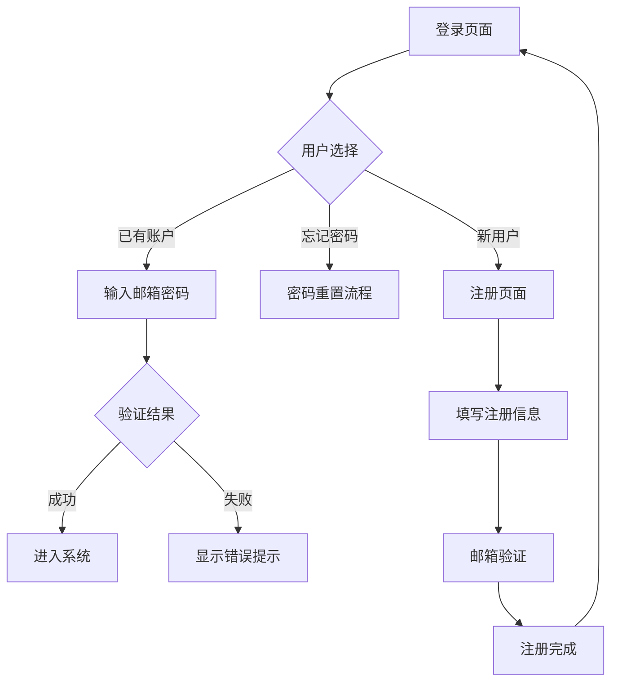

## 1. 产品概述
企业级CRM系统登录与用户账户模块，提供安全、简洁的用户认证体验。专为B2B企业客户设计，支持多角色权限管理，确保系统安全性和易用性。

## 2. 核心功能

### 2.1 用户角色
| 角色 | 注册方式 | 核心权限 |
|------|----------|----------|
| 管理员 | 后台创建 | 系统管理、用户管理、权限配置 |
| 普通员工 | 管理员邀请注册 | 客户管理、数据查看、基础操作 |
| 访客用户 | 自助注册 | 仅限登录查看公开信息 |

### 2.2 功能模块
CRM登录与账户模块包含以下核心页面：
1. **登录页面**：用户认证、记住密码、忘记密码链接
2. **注册页面**：用户注册、邮箱验证、密码强度提示
3. **修改密码页面**：密码修改、安全验证、强度校验

### 2.3 页面详情
| 页面名称 | 模块名称 | 功能描述 |
|----------|----------|----------|
| 登录页面 | 登录表单 | 输入邮箱和密码进行身份验证，包含记住密码选项 |
| 登录页面 | 忘记密码 | 点击后跳转至密码重置流程 |
| 注册页面 | 注册表单 | 输入邮箱、密码、确认密码完成注册，实时密码强度提示 |
| 注册页面 | 邮箱验证 | 发送验证邮件，用户点击链接激活账户 |
| 修改密码页面 | 密码修改表单 | 输入当前密码、新密码、确认新密码，实时强度校验 |
| 修改密码页面 | 安全验证 | 可选择邮箱验证码或短信验证码进行二次验证 |

## 3. 核心流程
用户操作流程：
1. 新用户通过注册页面创建账户，系统自动发送验证邮件
2. 用户点击邮件链接激活账户后，可正常登录系统
3. 已登录用户可在个人设置中修改密码，需通过安全验证
4. 忘记密码用户可通过邮箱重置密码

## 4. 用户界面设计

### 4.1 设计风格
- **主色调**：深蓝色 (#1e40af) 体现企业专业性
- **辅助色**：浅灰色 (#f3f4f6) 用于背景和边框
- **按钮样式**：圆角矩形，主要按钮使用渐变色
- **字体**：系统默认字体，标题16px，正文14px
- **布局风格**：居中卡片式布局，简洁明了
- **图标风格**：线性图标，统一使用Feather Icons

### 4.2 页面设计概览
| 页面名称 | 模块名称 | UI元素 |
|----------|----------|--------|
| 登录页面 | 登录卡片 | 白色背景卡片，宽度400px，阴影效果，包含logo、标题、表单 |
| 注册页面 | 注册表单 | 分步骤显示，第一步基本信息，第二步邮箱验证 |
| 修改密码页面 | 密码表单 | 三栏输入框布局，实时强度指示器，安全提示信息 |

### 4.3 响应式设计
- 桌面端优先设计，默认宽度1200px
- 平板端自适应，卡片宽度调整为90%
- 移动端优化，表单元素垂直排列，按钮放大便于触摸