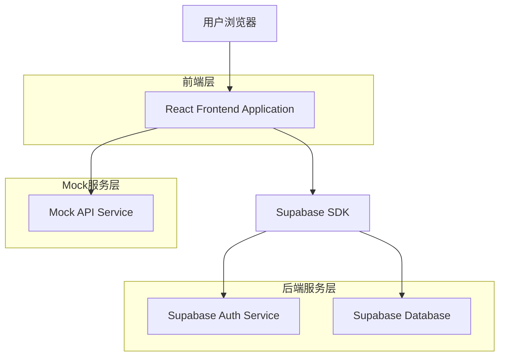
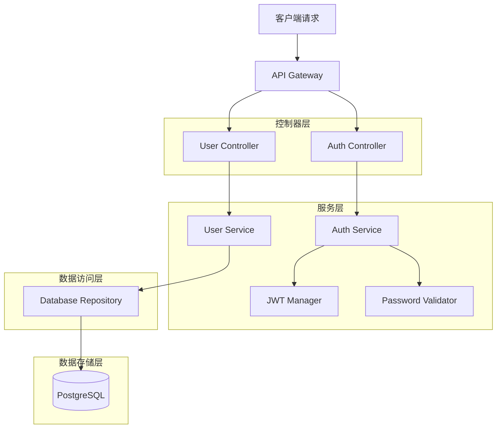
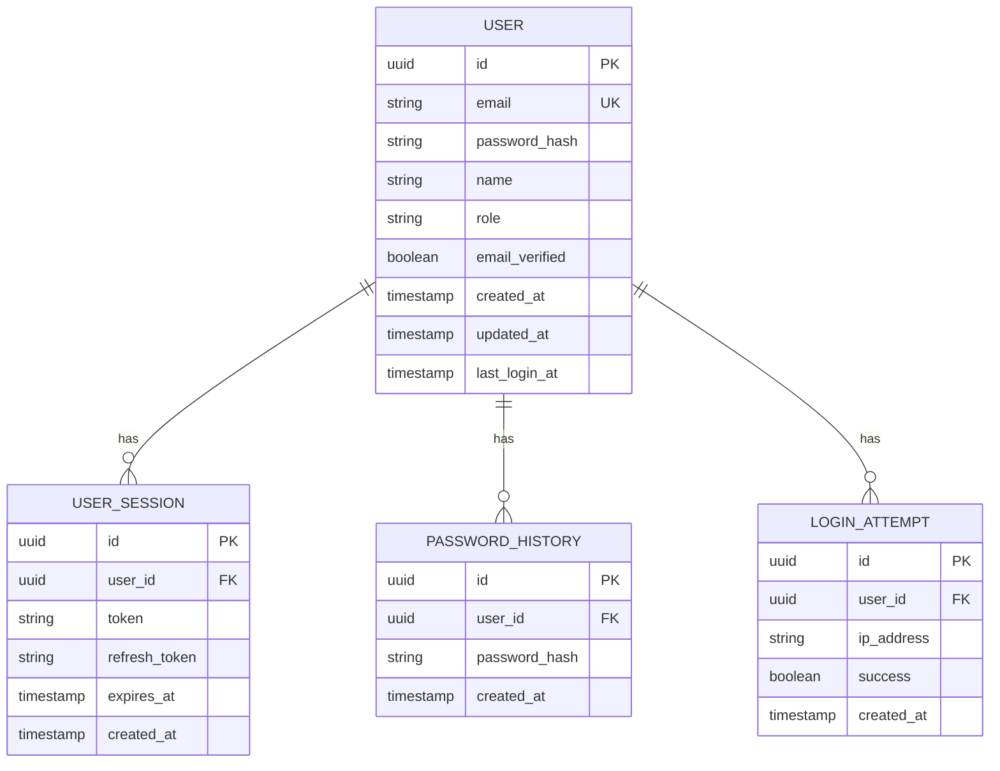

## 1. 架构设计



## 2. 技术栈描述

- **前端**: React@18 + TypeScript@5 + Tailwind CSS@3 + Vite@5
- **初始化工具**: vite-init
- **UI组件库**: Headless UI + Heroicons
- **状态管理**: React Context + useReducer
- **表单验证**: React Hook Form + Zod
- **Mock服务**: MSW (Mock Service Worker)
- **后端**: Supabase (PostgreSQL + Auth + Storage)

## 3. 路由定义

| 路由 | 用途 |
|------|------|
| /login | 登录页面，用户身份验证 |
| /register | 注册页面，新用户注册 |
| /forgot-password | 忘记密码页面，密码重置 |
| /reset-password | 重置密码页面，设置新密码 |
| /change-password | 修改密码页面，已登录用户修改密码 |
| /email-verification | 邮箱验证页面，账户激活 |

## 4. API定义

### 4.1 认证相关API

**用户登录**
```
POST /api/auth/login
```

请求参数：
| 参数名 | 参数类型 | 是否必需 | 描述 |
|--------|----------|----------|------|
| email | string | 是 | 用户邮箱地址 |
| password | string | 是 | 用户密码 |
| rememberMe | boolean | 否 | 记住登录状态 |

响应参数：
| 参数名 | 参数类型 | 描述 |
|--------|----------|------|
| success | boolean | 登录成功状态 |
| token | string | JWT访问令牌 |
| refreshToken | string | 刷新令牌 |
| user | object | 用户信息对象 |

**用户注册**
```
POST /api/auth/register
```

请求参数：
| 参数名 | 参数类型 | 是否必需 | 描述 |
|--------|----------|----------|------|
| email | string | 是 | 注册邮箱地址 |
| password | string | 是 | 用户密码 |
| confirmPassword | string | 是 | 确认密码 |
| companyName | string | 是 | 公司名称 |

**修改密码**
```
POST /api/auth/change-password
```

请求参数：
| 参数名 | 参数类型 | 是否必需 | 描述 |
|--------|----------|----------|------|
| currentPassword | string | 是 | 当前密码 |
| newPassword | string | 是 | 新密码 |
| confirmPassword | string | 是 | 确认新密码 |

### 4.2 TypeScript类型定义

```typescript
// 用户类型
interface User {
  id: string;
  email: string;
  name: string;
  role: 'admin' | 'user' | 'guest';
  createdAt: Date;
  lastLoginAt: Date;
}

// 登录请求类型
interface LoginRequest {
  email: string;
  password: string;
  rememberMe?: boolean;
}

// 登录响应类型
interface LoginResponse {
  success: boolean;
  token: string;
  refreshToken: string;
  user: User;
}

// 注册请求类型
interface RegisterRequest {
  email: string;
  password: string;
  confirmPassword: string;
  companyName: string;
}

// 密码强度类型
interface PasswordStrength {
  score: number; // 0-4
  feedback: string[];
  warning?: string;
}
```

## 5. 服务器架构图



## 6. 数据模型

### 6.1 数据模型定义



### 6.2 数据定义语言

**用户表 (users)**
```sql
-- 创建用户表
CREATE TABLE users (
    id UUID PRIMARY KEY DEFAULT gen_random_uuid(),
    email VARCHAR(255) UNIQUE NOT NULL,
    password_hash VARCHAR(255) NOT NULL,
    name VARCHAR(100) NOT NULL,
    role VARCHAR(20) DEFAULT 'user' CHECK (role IN ('admin', 'user', 'guest')),
    email_verified BOOLEAN DEFAULT FALSE,
    created_at TIMESTAMP WITH TIME ZONE DEFAULT NOW(),
    updated_at TIMESTAMP WITH TIME ZONE DEFAULT NOW(),
    last_login_at TIMESTAMP WITH TIME ZONE
);

-- 创建用户会话表
CREATE TABLE user_sessions (
    id UUID PRIMARY KEY DEFAULT gen_random_uuid(),
    user_id UUID REFERENCES users(id) ON DELETE CASCADE,
    token VARCHAR(500) NOT NULL,
    refresh_token VARCHAR(500) NOT NULL,
    expires_at TIMESTAMP WITH TIME ZONE NOT NULL,
    created_at TIMESTAMP WITH TIME ZONE DEFAULT NOW()
);

-- 创建密码历史表
CREATE TABLE password_history (
    id UUID PRIMARY KEY DEFAULT gen_random_uuid(),
    user_id UUID REFERENCES users(id) ON DELETE CASCADE,
    password_hash VARCHAR(255) NOT NULL,
    created_at TIMESTAMP WITH TIME ZONE DEFAULT NOW()
);

-- 创建登录尝试记录表
CREATE TABLE login_attempts (
    id UUID PRIMARY KEY DEFAULT gen_random_uuid(),
    user_id UUID REFERENCES users(id) ON DELETE CASCADE,
    ip_address INET,
    success BOOLEAN NOT NULL,
    created_at TIMESTAMP WITH TIME ZONE DEFAULT NOW()
);

-- 创建索引
CREATE INDEX idx_users_email ON users(email);
CREATE INDEX idx_users_role ON users(role);
CREATE INDEX idx_sessions_user_id ON user_sessions(user_id);
CREATE INDEX idx_sessions_token ON user_sessions(token);
CREATE INDEX idx_password_history_user_id ON password_history(user_id);
CREATE INDEX idx_login_attempts_user_id ON login_attempts(user_id);
CREATE INDEX idx_login_attempts_created_at ON login_attempts(created_at DESC);

-- 设置权限
GRANT SELECT ON users TO anon;
GRANT ALL PRIVILEGES ON users TO authenticated;
GRANT SELECT ON user_sessions TO anon;
GRANT ALL PRIVILEGES ON user_sessions TO authenticated;
```

### 6.3 Mock数据示例

```typescript
// 模拟用户数据
const mockUsers = [
  {
    id: '550e8400-e29b-41d4-a716-446655440000',
    email: 'admin@company.com',
    name: '系统管理员',
    role: 'admin',
    email_verified: true,
    created_at: '2024-01-01T00:00:00Z',
    last_login_at: '2024-01-14T10:30:00Z'
  },
  {
    id: '660e8400-e29b-41d4-a716-446655440001',
    email: 'user@company.com',
    name: '普通员工',
    role: 'user',
    email_verified: true,
    created_at: '2024-01-05T00:00:00Z',
    last_login_at: '2024-01-13T15:45:00Z'
  }
];

// 模拟登录响应
const mockLoginResponse = {
  success: true,
  token: 'eyJhbGciOiJIUzI1NiIsInR5cCI6IkpXVCJ9.mock.token',
  refreshToken: 'eyJhbGciOiJIUzI1NiIsInR5cCI6IkpXVCJ9.mock.refresh',
  user: mockUsers[0]
};
```