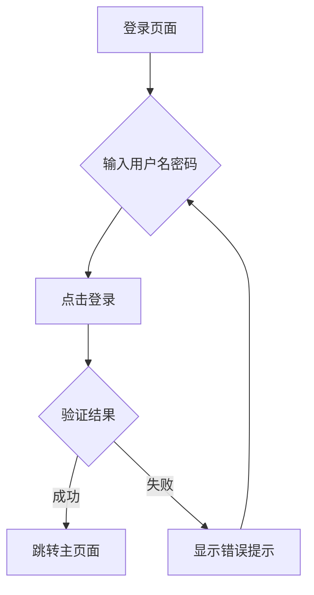

## 1. 产品概述
CRM登录页面是企业客户关系管理系统的入口界面，为用户提供安全便捷的登录体验。
- 解决企业员工访问CRM系统的身份验证问题
- 目标用户为企业内部员工和管理人员
- 提供简洁直观的登录界面，支持基本的身份验证功能

## 2. 核心功能

### 2.1 用户角色
本页面主要服务于企业内部用户，暂不需要复杂的角色区分。

### 2.2 功能模块
登录页面包含以下核心模块：
1. **登录表单**: 用户名输入、密码输入、登录按钮
2. **品牌展示**: 公司Logo、系统名称
3. **辅助功能**: 记住密码、忘记密码链接

### 2.3 页面详情
| 页面名称 | 模块名称 | 功能描述 |
|-----------|-------------|-------------|
| 登录页面 | 品牌展示区域 | 显示公司Logo和CRM系统名称，提升品牌识别度 |
| 登录页面 | 登录表单 | 包含用户名输入框、密码输入框，支持表单验证和错误提示 |
| 登录页面 | 操作按钮 | 登录按钮，点击后执行登录验证逻辑 |
| 登录页面 | 辅助功能 | 提供记住密码选项和忘记密码链接 |

## 3. 核心流程
用户访问登录页面的主要操作流程：
1. 用户进入登录页面
2. 输入用户名和密码
3. 点击登录按钮进行验证
4. 验证成功则跳转到主页面，失败则显示错误信息

## 4. 用户界面设计

### 4.1 设计风格
- **主色调**: 深蓝色 (#1e40af) 体现专业性
- **辅助色**: 白色背景，灰色边框
- **按钮样式**: 圆角矩形，悬停效果
- **字体**: 系统默认字体，标题18px，正文14px
- **布局风格**: 居中卡片式布局，左右分栏（左侧品牌，右侧表单）

### 4.2 页面设计概述
| 页面名称 | 模块名称 | UI元素 |
|-----------|-------------|-------------|
| 登录页面 | 品牌展示区域 | 左侧占据40%宽度，居中显示公司Logo，下方显示CRM系统名称，使用深蓝色背景 |
| 登录页面 | 登录表单 | 右侧占据60%宽度，白色卡片背景，包含标题"欢迎登录"，用户名和密码输入框，圆角边框设计 |
| 登录页面 | 操作按钮 | 蓝色登录按钮，宽度100%，圆角设计，悬停时颜色加深 |
| 登录页面 | 辅助功能 | 记住密码复选框左对齐，忘记密码链接右对齐，使用小号字体 |

### 4.3 响应式设计
采用桌面端优先设计，支持自适应布局：
- 桌面端：左右分栏布局，最佳体验
- 平板端：保持左右布局，适当调整比例
- 移动端：垂直堆叠布局，单栏显示

### 4.4 交互设计
- 输入框获得焦点时边框高亮显示
- 登录按钮点击后有加载状态
- 错误提示使用红色文字显示在对应输入框下方
- 支持Enter键快速登录