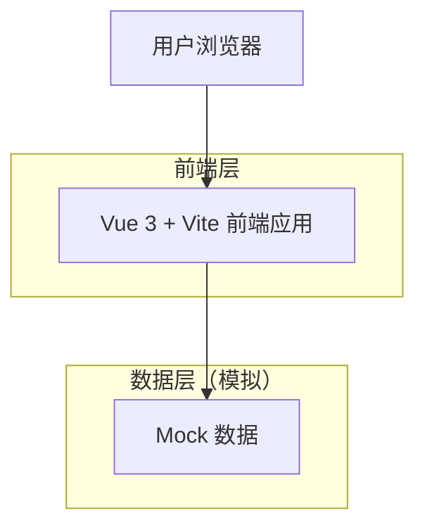

## 1. 架构设计



## 2. 技术栈描述

- **前端**: Vue 3@latest + Vite + Tailwind CSS
- **初始化工具**: vite-init
- **后端**: 无（纯前端项目，使用Mock数据）

## 3. 路由定义

| 路由 | 用途 |
|-------|---------|
| / | 登录页面，提供用户身份验证界面 |
| /login | 登录页面，与根路径相同 |

## 4. 组件架构

### 4.1 主要组件
- **LoginForm**: 登录表单组件，包含用户名、密码输入和验证逻辑
- **BrandSection**: 品牌展示组件，显示Logo和系统名称
- **InputField**: 通用输入框组件，支持验证和错误提示

### 4.2 状态管理
使用 Vue 3 的 Composition API 进行组件状态管理：
```javascript
const loginForm = reactive({
  username: '',
  password: '',
  rememberMe: false
})

const validation = reactive({
  usernameError: '',
  passwordError: '',
  isLoading: false
})
```

## 5. 表单验证规则

### 5.1 客户端验证
- **用户名**: 必填，长度3-20个字符，支持字母、数字、下划线
- **密码**: 必填，长度6-20个字符，必须包含字母和数字

### 5.2 错误处理
- 实时验证：输入框失焦时触发验证
- 提交验证：点击登录按钮时验证所有字段
- 错误显示：在对应输入框下方显示具体错误信息

## 6. Mock数据设计

### 6.1 模拟用户数据
```javascript
const mockUsers = [
  {
    username: 'admin',
    password: 'admin123',
    name: '管理员',
    role: 'admin'
  },
  {
    username: 'user1', 
    password: 'user123',
    name: '普通用户',
    role: 'user'
  }
]
```

### 6.2 模拟API响应
```javascript
// 登录验证
const mockLogin = (username, password) => {
  const user = mockUsers.find(u => u.username === username && u.password === password)
  if (user) {
    return {
      success: true,
      token: 'mock-jwt-token-' + Date.now(),
      user: {
        username: user.username,
        name: user.name,
        role: user.role
      }
    }
  }
  return {
    success: false,
    message: '用户名或密码错误'
  }
}
```

## 7. 本地存储方案

### 7.1 存储内容
- **登录状态**: 使用 localStorage 存储登录令牌
- **记住密码**: 用户选择时存储用户名（不存储密码）
- **用户信息**: 登录成功后缓存用户基本信息

### 7.2 存储结构
```javascript
// localStorage 键值设计
const STORAGE_KEYS = {
  TOKEN: 'crm_login_token',
  USER_INFO: 'crm_user_info',
  REMEMBER_USERNAME: 'crm_remember_username'
}
```

## 8. 安全性考虑

### 8.1 前端安全措施
- 密码输入框使用 type="password" 隐藏输入内容
- 登录表单防止重复提交
- 敏感信息不存储在本地
- 使用 HTTPS 协议（部署时）

### 8.2 验证流程
1. 客户端基础验证
2. 模拟后端验证（Mock数据）
3. 登录状态管理
4. 路由守卫（后续扩展）

## 9. 性能优化

### 9.1 构建优化
- 使用 Vite 的按需加载
- 生产环境代码压缩
- 图片资源优化

### 9.2 运行时优化
- 组件级别的状态管理
- 避免不必要的重渲染
- 使用 computed 属性缓存计算结果