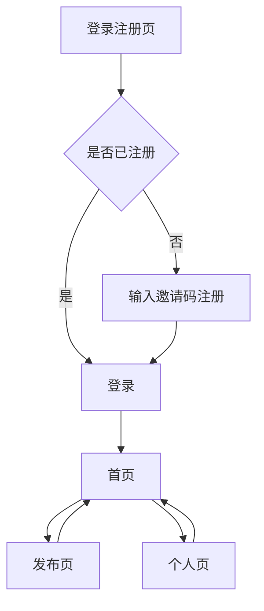

## 1. Product Overview
极简照片分享Web应用，类似简化版小红书。用户通过邀请码注册，发布图片配简短文字，在小圈子内分享生活瞬间。
- 解决私密分享需求，避免公开社交压力
- 面向追求简洁、私密分享体验的用户群体

## 2. Core Features

### 2.1 User Roles
| Role | Registration Method | Core Permissions |
|------|---------------------|------------------|
| 普通用户 | 邀请码注册 | 发布内容、浏览内容、个人资料管理 |
| 管理员 | 后台创建 | 生成邀请码、内容管理、用户管理 |

### 2.2 Feature Module
极简照片分享应用包含以下核心页面：
1. **登录注册页**：用户登录、邀请码验证注册
2. **首页**：图片流展示、发布入口
3. **发布页**：图片上传、文字描述
4. **个人页**：个人资料、我的发布

### 2.3 Page Details
| Page Name | Module Name | Feature description |
|-----------|-------------|---------------------|
| 登录注册页 | 登录模块 | 输入邮箱密码登录，记住登录状态 |
| 登录注册页 | 注册模块 | 输入邀请码、邮箱、密码完成注册 |
| 首页 | 图片流 | 按时间倒序展示所有用户发布的图片卡片 |
| 首页 | 发布按钮 | 点击跳转到发布页面的悬浮按钮 |
| 发布页 | 图片上传 | 选择单张图片，支持拖拽上传，限制5MB |
| 发布页 | 文字描述 | 输入最多200字的文字描述 |
| 发布页 | 发布按钮 | 点击发布，成功后跳转到首页 |
| 个人页 | 个人资料 | 显示头像、用户名、注册时间 |
| 个人页 | 我的发布 | 网格布局展示个人发布的所有内容 |

## 3. Core Process
用户首次访问需注册，输入有效邀请码完成注册后登录。登录后进入首页浏览图片流，点击右下角发布按钮可上传图片并添加简短描述。个人页展示用户资料和发布历史。

## 4. User Interface Design
### 4.1 Design Style
- 主色：纯白背景 (#FFFFFF)
- 辅色：淡灰色 (#F5F5F5)、深灰色 (#333333)
- 按钮：圆角矩形，主按钮黑色，次要按钮白色描边
- 字体：系统默认字体，标题18px，正文14px
- 布局：卡片式瀑布流，顶部导航栏
- 图标：线性图标风格，简洁轻量

### 4.2 Page Design Overview
| Page Name | Module Name | UI Elements |
|-----------|-------------|-------------|
| 登录注册页 | 表单区域 | 居中卡片，白色背景，圆角12px，内边距32px |
| 首页 | 图片卡片 | 图片占满宽度，下方显示用户名和描述文字，卡片间距12px |
| 发布页 | 上传区域 | 虚线框上传区域，高200px，支持拖拽，提示文字居中 |
| 个人页 | 头像区域 | 圆形头像80px，用户名字号20px，加粗显示 |

### 4.3 Responsiveness
采用桌面优先设计，适配移动端。图片流在桌面端为3列网格，平板2列，手机单列。所有交互元素最小点击区域44px，支持触摸操作。